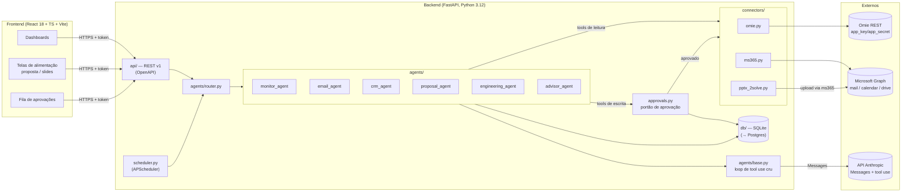
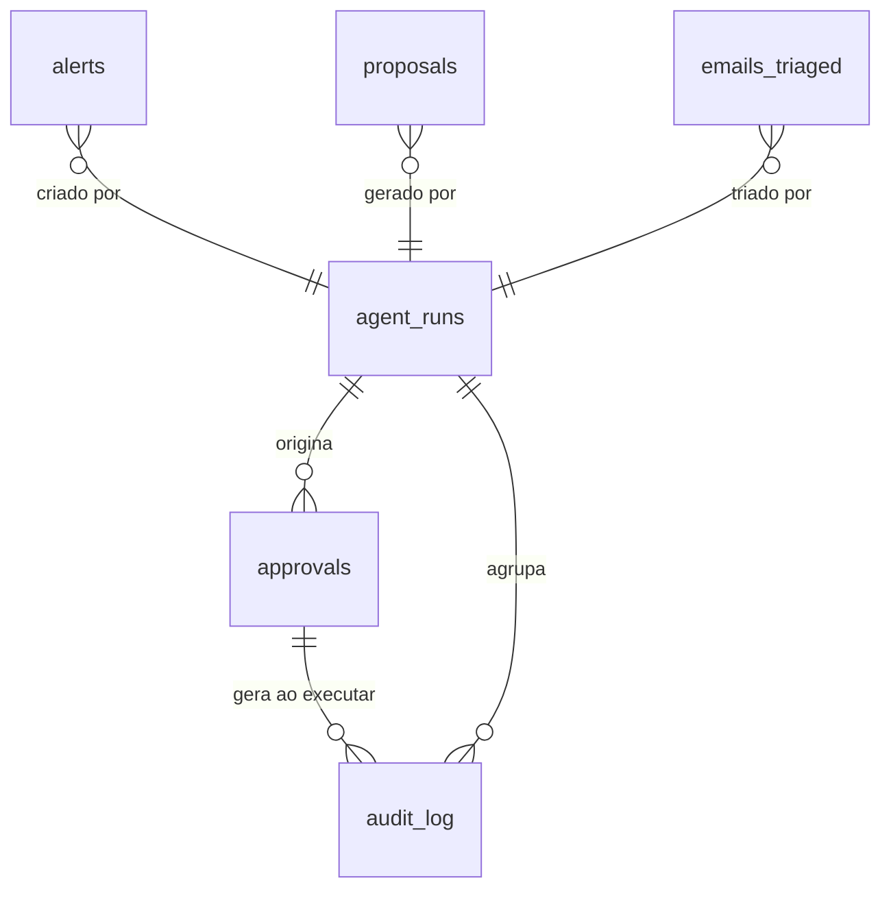
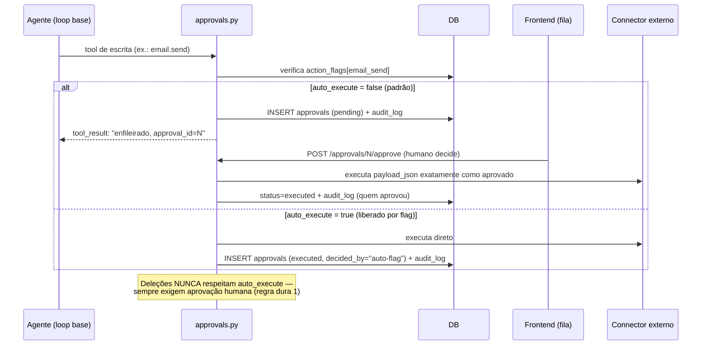

# 02 — Arquitetura: Assistente Comercial 2Solve

> Etapa 1 do plano. Baseado em `CLAUDE.md` e `docs/01-conceito.md`.

## 1. Diagrama de componentes

**Fluxo de demanda:** toda demanda (requisição da API, job do scheduler ou
chamada de outro agente) entra pelo `router.py`, que escolhe o agente. O agente
roda o loop base (`base.py`): chama a API Messages com seu system prompt e suas
tools; cada tool de **leitura** executa direto no connector; cada tool de
**escrita externa** não executa — cria um registro `pending` em `approvals` e
devolve ao modelo "ação enfileirada para aprovação humana". Tudo grava em
`audit_log`.

## 2. Modelo de dados

| Tabela | Campos principais | Observações |
|---|---|---|
| `agent_runs` | id, agent (enum), trigger (api/scheduler/agent), input_json, output_json, status (running/done/error), started_at, finished_at, tokens_in, tokens_out | Uma linha por execução de agente |
| `audit_log` | id, run_id FK, tool_name, input_json, output_json, is_write (bool), approval_id FK nullable, created_at | **Toda** chamada de tool; regra dura 3 |
| `approvals` | id, run_id FK, action_type (email_send/email_forward/email_delete/omie_create/omie_update/omie_delete), payload_json, preview_text, status (pending/approved/rejected/executed/failed), requested_at, decided_at, decided_by, executed_at, error | O portão. `payload_json` é exatamente o que será executado |
| `alerts` | id, run_id FK, kind (followup_overdue/proposal_stale/task_overdue), entity_ref (id Omie), title, detail, severity, status (open/dismissed/done), created_at | Saída do monitor_agent |
| `emails_triaged` | id, run_id FK, graph_message_id, classification (lead/cliente_ativo/fornecedor/interno/irrelevante), summary, draft_id nullable, created_at | Saída do email_agent |
| `proposals` | id, run_id FK, omie_client_id, title, input_json (escopo/itens/prazo), pptx_path, onedrive_url, status (draft/generated/error), created_at | Saída do proposal_agent |
| `pipeline_cache` | id, omie_entity (client/opportunity/task), omie_id, payload_json, synced_at | Cache de leitura do Omie p/ dashboard e advisor (evita rate limit) |
| `action_flags` | action_type PK, auto_execute (bool, default false), updated_at, updated_by | Liberação gradual por ação (regra dura 2) |

Convenções: SQLAlchemy 2.x declarativo, `*_json` como `JSON` (portável
SQLite→Postgres), timestamps UTC, Alembic desde o início para a migração
futura não doer.

## 3. Contratos REST — API v1

Prefixo `/api/v1`. OpenAPI automático em `/docs`. JSON em snake_case.
Erros: `{"detail": str, "code": str}` com status HTTP adequado.

### Saúde e meta
| Rota | Método | Descrição |
|---|---|---|
| `/health` | GET | Status do app, DB e schedulers |

### Alertas (Etapa 2)
| Rota | Método | Payload / Retorno |
|---|---|---|
| `/alerts` | GET | `?status=open&kind=` → lista paginada de `Alert` |
| `/alerts/{id}` | PATCH | `{"status": "dismissed"\|"done"}` → `Alert` |
| `/agents/monitor/run` | POST | dispara varredura manual → `{"run_id": int}` (202) |

### Aprovações (transversal, nasce na Etapa 2)
| Rota | Método | Payload / Retorno |
|---|---|---|
| `/approvals` | GET | `?status=pending` → lista de `Approval` (com `preview_text`) |
| `/approvals/{id}` | GET | `Approval` completo com payload |
| `/approvals/{id}/approve` | POST | `{"decided_by": str}` → executa a ação, grava audit, retorna `Approval` atualizado |
| `/approvals/{id}/reject` | POST | `{"decided_by": str, "reason": str?}` → `Approval` |

### Emails (Etapa 3)
| Rota | Método | Payload / Retorno |
|---|---|---|
| `/emails/triaged` | GET | `?classification=&since=` → lista de `EmailTriaged` |
| `/emails/{id}/draft` | GET | rascunho associado (corpo, destinatários) |
| `/agents/email/triage` | POST | dispara triagem manual → `{"run_id": int}` (202) |

### Propostas (Etapa 4)
| Rota | Método | Payload / Retorno |
|---|---|---|
| `/proposals` | POST | `{"omie_client_id", "title", "scope", "items": [...], "deadline", "conditions"}` → cria e dispara geração (202, `{"proposal_id"}`) |
| `/proposals` | GET | lista paginada |
| `/proposals/{id}` | GET | status + `onedrive_url` |
| `/proposals/{id}/download` | GET | streaming do PPTX |

### Dashboard e advisor (Etapa 7)
| Rota | Método | Retorno |
|---|---|---|
| `/dashboard/pipeline` | GET | estágios com valor/quantidade (do `pipeline_cache`) |
| `/dashboard/operations` | GET | métricas do assistente (triagens/dia, fila, executadas vs. rejeitadas) |
| `/advisor/analysis` | GET | última análise; `POST /agents/advisor/run` para gerar nova |

### Auditoria
| Rota | Método | Retorno |
|---|---|---|
| `/audit` | GET | `?agent=&is_write=&from=&to=` → log paginado e navegável |

**Versionamento:** mudanças incompatíveis ⇒ `/api/v2`; `/api/v1` mantido até o
frontend migrar. Schemas pydantic são a fonte da verdade do contrato.

## 4. Fluxo do portão de aprovação

Invariantes implementadas em `approvals.py` (e testadas):
1. O payload executado é **byte a byte** o payload aprovado — o agente não
   pode alterá-lo após a aprovação.
2. `action_type` de deleção ignora `action_flags` — sempre pending.
3. Execução é idempotente: aprovar duas vezes não executa duas vezes
   (transição de estado `approved → executed` é única).
4. Falha na execução marca `failed` com `error` e **não** silencia.

## 5. Autenticação

**Frontend → Backend:** sessão por **JWT curto** (access token ~30 min) +
refresh token httpOnly. Login com email/senha local na v1 (tabela `users`,
hash argon2) — time pequeno, sem necessidade de SSO no dia 1. Evolução natural:
trocar o login local por **OAuth Microsoft Entra ID** (o time já vive no M365),
mantendo o mesmo formato de JWT interno — o frontend não muda.
`decided_by` das aprovações = usuário autenticado (do token, nunca do body —
o campo no payload é só fallback até a auth entrar na Etapa 3).

**Backend → Externos:**
- Omie: `app_key`/`app_secret` via env, injetados no corpo de cada chamada
  (padrão Omie).
- Graph: **client credentials** (app-only) com escopos mínimos por recurso,
  restritos à caixa comercial via Application Access Policy. Token cacheado
  via MSAL.
- Anthropic: `ANTHROPIC_API_KEY` via env; modelo por `CLAUDE_MODEL`.

## 6. Riscos técnicos e decisões

| # | Risco | Mitigação |
|---|---|---|
| R1 | Rate limit / instabilidade da API Omie | `pipeline_cache` com sync agendado; retries exponenciais no connector; dashboard lê do cache, nunca do Omie direto |
| R2 | Variação dos payloads Omie (campos custom) | pydantic com `extra="allow"`; testes com fixtures de respostas reais gravadas |
| R3 | Permissões Graph app-only amplas demais | Application Access Policy limitando à caixa comercial; escopos por recurso documentados no `.env.example` |
| R4 | Alucinação do LLM em ação de escrita | Toda escrita é gated + `preview_text` legível por humano na fila; payload congelado na aprovação |
| R5 | SQLite com escrita concorrente (API + scheduler) | WAL mode; escrita centralizada em sessões curtas; Alembic pronto para migrar a Postgres quando o volume justificar |
| R6 | Custo/latência do LLM | `CLAUDE_MODEL` por tarefa (Sonnet rotina, Opus proposta); contagem de tokens em `agent_runs` para acompanhar custo |
| R7 | Frontend dedicado bloqueado pelo backend | OpenAPI publicado desde a Etapa 2; mudanças incompatíveis só com bump de versão |

| Decisão | Justificativa |
|---|---|
| Router próprio (sem n8n/SDK/CrewAI) | Controle total do loop, das tools e do portão; menos dependências; CLAUDE.md manda |
| Approvals como tabela + flags por ação | Liberação gradual auditável; rollback trivial (flag off) |
| Alembic desde o dia 1 | Migração SQLite→Postgres planejada; schema vai evoluir a cada etapa |
| JWT local antes de Entra ID | Destrava as Etapas 2–4 sem registro de app adicional; rota de evolução clara |
| `pipeline_cache` em vez de consulta ao vivo | Dashboard rápido e resiliente; Omie vira dependência assíncrona |
| Tools de leitura executam direto; escrita só via gate | Regra dura 6: leitura é livre, escrita é cara |
