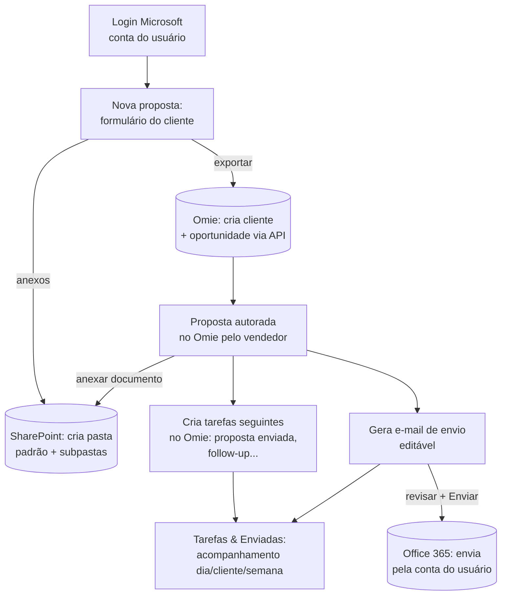

# 04 — Replanejamento v2: fluxo de Propostas + integração Microsoft 365

> **Status: arquitetura para revisão.** Implementação pausada para alinhamento
> com o time (colega/gerente). Este documento consolida a visão refinada pelo
> dono do produto sobre a v1 já construída (Etapas 0–7).
> Material de apoio para a reunião: o preview navegável em `preview/index.html`.

---

## 1. Contexto

A v1 entregou a fundação completa (6 agentes, portão de aprovação, auditoria,
dashboards) com Propostas geradas como PPTX no padrão 2Solve. O refinamento
muda o **centro de gravidade**: a proposta passa a ser **autorada no Omie**, e a
aplicação vira o **orquestrador do fluxo comercial ponta a ponta** — da captura
do cliente ao follow-up — fortemente integrada ao Microsoft 365 (login,
SharePoint e e-mail pela conta do usuário).

## 2. As 7 solicitações (mapeadas)

| # | Solicitação | Onde entra |
|---|---|---|
| 1 | Formulário de dados do cliente/oportunidade (CNPJ, razão social, contato, telefone, e-mail, nome e detalhes da oportunidade) → preenchimento automático no Omie via API | Propostas › **Nova proposta** |
| 2 | Anexar documentos do cliente + criar pasta padrão (com subpastas) no SharePoint da 2Solve | Propostas › **Nova proposta** |
| 3 | Criar e acompanhar tarefas do Omie pela app — por dia, cliente e semana | Propostas › **Tarefas** |
| 4 | Acompanhar propostas enviadas + histórico resumido | Propostas › **Enviadas** |
| 5 | Proposta autorada no Omie; anexar aqui → SharePoint; criar tarefas seguintes (proposta enviada, follow-up…); gerar e-mail de envio editável via Office 365 | Propostas › **Enviadas** + Emails |
| 6 | E-mails por etapa do funil (agradecimento de reunião, solicitação de info, envio de proposta, follow-up…), com nome do cliente + demanda Omie + etapa; texto editável; **Enviar** pela conta do usuário | **Emails** |
| 7 | Login pela conta de e-mail (Microsoft) desde o início | **Login** |

> **Engenharia pausada (2026-06-14):** o módulo de Engenharia da v1
> (`engineering_agent`, ISA-5.1, fluxogramas, memoriais) fica **fora deste
> replanejamento**. O dono do produto vai repensar como estruturá-lo num
> segundo momento. O código da v1 permanece no repo, intocado; apenas não
> recebe evolução agora e saiu do preview v2.

## 3. Fluxo de Propostas ponta a ponta (visão refinada)

Toda **escrita externa** (criar no Omie, criar pasta/anexar no SharePoint,
enviar e-mail) continua nascendo atrás do **portão de aprovação** com auditoria
(regras duras inalteradas) — a liberação por flag, ação por ação, decide o que
pode auto-executar.

## 4. Mudanças de arquitetura vs. v1

### 4.1 Autenticação — Entra ID desde o início (solicitação 7)
- v1: JWT local primeiro, Entra ID depois. **v2: login Microsoft (Entra ID /
  MSAL, OAuth Authorization Code + PKCE) já na fundação.** A identidade do
  usuário logado vira o `decided_by` das aprovações e o remetente dos e-mails.
- Implica escopos **delegados** do Graph (em nome do usuário), não mais só
  app-only.

### 4.2 E-mail — envio delegado pela conta do usuário (solicitações 5 e 6)
- v1: envio app-only por caixa compartilhada (`Mail.Send` de aplicação).
- v2: **`Mail.Send` delegado** — o e-mail sai da conta do próprio usuário
  logado. O botão **Enviar** dispara `POST /me/sendMail` no contexto do token
  do usuário. Continua passando pelo portão (preview + aprovação/edição) antes
  de sair.

### 4.3 Novo connector — SharePoint (solicitações 2 e 5)
- `connectors/sharepoint.py` (Microsoft Graph `sites`/`drives`): criar pasta
  padrão + subpastas por cliente/oportunidade e fazer upload dos documentos.
- **Nomenclatura e árvore de subpastas: a definir com o time** (ver §8).

### 4.4 Omie — cadastro a partir do formulário + tarefas (solicitações 1, 3, 5)
- Já temos escrita gated no Omie (Etapa 5). Estende para:
  - cadastro de **cliente + oportunidade** a partir do formulário de Nova
    proposta (um fluxo, não dois passos manuais);
  - **tarefas**: criar (proposta enviada, follow-up, etc.) e **listar/agrupar
    por dia, cliente e semana** (connector Omie ganha leitura/escrita de tarefas).

### 4.5 Proposta — autoria no Omie (solicitação 5)
- v1: `proposal_agent` + `pptx_2solve` geravam o PPTX aqui.
- v2: **a proposta é feita no Omie**; a app anexa o documento resultante na
  pasta do SharePoint e encadeia tarefas + e-mail. → O gerador `pptx_2solve`
  **não é mais o caminho principal**; fica como capacidade opcional (decisão em §8).

### 4.6 E-mails por etapa (solicitação 6)
- Catálogo de **tipos de e-mail por etapa do funil**, cada um com um template.
  O agente preenche o template com nome do cliente + dados da demanda Omie +
  etapa; o usuário **edita** e clica **Enviar**.

## 5. Modelo de dados — adições/ajustes

| Tabela | Mudança |
|---|---|
| `proposals` | Acrescentar dados do formulário (cnpj, razão social, contato, telefone, e-mail, nome/detalhes da oportunidade), `omie_opportunity_id`, `sharepoint_folder_url`, `status` do fluxo (rascunho → cliente_cadastrado → proposta_no_omie → enviada → follow_up). PPTX local vira opcional. |
| `client_documents` (nova) | Anexos do cliente: proposal_id, nome, tamanho, sharepoint_item_url, enviado_em. |
| `omie_tasks` (nova) | Espelho/local das tarefas do Omie: omie_task_id, proposal_id, cliente_ref, titulo, tipo (proposta_enviada/follow_up/…), data_prevista, status, synced_at. Alimenta a subaba Tarefas (dia/cliente/semana). |
| `email_templates` (nova) | Catálogo por etapa: chave (agradecimento_reuniao, solicitar_info, envio_proposta, follow_up…), assunto_modelo, corpo_modelo. |
| `outbound_emails` (nova) | E-mails compostos: proposal_id, tipo, destinatario, assunto, corpo (editado), status (rascunho/aprovado/enviado), enviado_por, enviado_em. |
| `approvals` | Novos `action_type`: `omie_task_create`, `sharepoint_folder_create`, `sharepoint_upload`, `email_send_user` (envio delegado). Deleção segue nunca auto-executável. |

## 6. Contratos REST — novas rotas (v1 da API → adições, sem quebrar o existente)

| Rota | Método | Descrição |
|---|---|---|
| `/auth/login`, `/auth/callback`, `/auth/me` | GET/POST | Fluxo OAuth Microsoft; usuário corrente |
| `/proposals` | POST | Agora recebe o formulário completo (cliente + oportunidade + necessidades) |
| `/proposals/{id}/export-omie` | POST | Enfileira cadastro de cliente + oportunidade no Omie |
| `/proposals/{id}/documents` | POST/GET | Upload de anexos do cliente (→ SharePoint) |
| `/proposals/{id}/sharepoint-folder` | POST | Enfileira criação da pasta padrão + subpastas |
| `/proposals/{id}/tasks` | POST/GET | Cria/lista tarefas seguintes no Omie |
| `/tasks` | GET | Tarefas agregadas por `?periodo=dia|semana&cliente=` |
| `/proposals/sent` | GET | Propostas enviadas + histórico resumido |
| `/emails/compose` | POST | Gera e-mail por `{tipo, cliente, demanda_omie, etapa}` |
| `/emails/{id}` | PATCH | Edita o texto antes de enviar |
| `/emails/{id}/send` | POST | **Enviar** — dispara pela conta do usuário (gated) |

## 7. O que muda vs. o que já está construído

| Já construído (v1) | Reaproveita | Muda / novo |
|---|---|---|
| Portão de aprovação + auditoria | ✅ integral | novos action_types |
| Loop de agente (tool use cru, 2 tiers de modelo) | ✅ integral | — |
| Connector Omie (read + write cliente/oportunidade) | ✅ | + tarefas (read/write), + fluxo cliente+oportunidade do formulário |
| Connector Graph (mail/calendário/OneDrive) | ✅ base | + SharePoint, + envio **delegado** |
| `email_agent` (triagem + rascunho) | ✅ base | + tipos de e-mail por etapa + Enviar pela conta do usuário |
| `proposal_agent` + `pptx_2solve` | parcial | proposta passa a ser autorada no Omie; PPTX vira opcional |
| Dashboards + advisor | ✅ integral | + indicadores de tarefas/follow-up |
| Auth | planejado | **antecipada**: Entra ID já na fundação |

## 8. Decisões a alinhar com o time (para a reunião)

1. **Nomenclatura e árvore de subpastas no SharePoint** — qual o padrão?
   (ex.: `/Comercial/Clientes/{Razão Social}/{Nº Oportunidade} - {Nome}/`
   com subpastas `01-Documentos do Cliente`, `02-Proposta`, `03-Contrato`…).
2. **Site/biblioteca do SharePoint** alvo (qual site da 2Solve, qual
   biblioteca de documentos).
3. **PPTX 2Solve** — descontinuar de vez, ou manter como opção de gerar uma
   capa/proposta visual a partir dos dados do Omie?
4. **Catálogo de tipos de e-mail** e etapas do funil — lista oficial e os
   textos-modelo de cada um.
5. **Quais ações entram liberadas por flag** (auto-executam) e quais sempre
   exigem aprovação — em especial o **envio de e-mail pela conta do usuário**.
6. **Tarefas do Omie** — tipos/etapas padrão (proposta enviada, follow-up D+3,
   D+7…?) e regra de geração automática.
7. **Escopos Microsoft Graph** a solicitar ao TI (delegados): `User.Read`,
   `Mail.Send`, `Mail.ReadWrite`, `Sites.ReadWrite.All` (ou `Sites.Selected`),
   `Calendars.Read`.

## 9. Próximas etapas de implementação (após alinhamento)

Mantendo o princípio de **risco crescente** (leitura → escrita gated):

- **R1. Login Microsoft (Entra ID)** + identidade do usuário nas aprovações.
- **R2. Formulário de Nova proposta** → cadastro de cliente + oportunidade no
  Omie (gated), reusando o `crm_agent`.
- **R3. SharePoint**: pasta padrão + upload de anexos (gated).
- **R4. Tarefas do Omie**: criar + acompanhar (dia/cliente/semana).
- **R5. E-mails por etapa** + envio delegado pela conta do usuário (gated).
- **R6. Propostas enviadas/histórico** + encadeamento de tarefas/e-mail.
- **R7. Ajuste de dashboards** com indicadores de follow-up/tarefas.

Cada etapa: connector com testes mockados (offline) + endpoints + tela, e nada
de escrita externa fora do portão.
